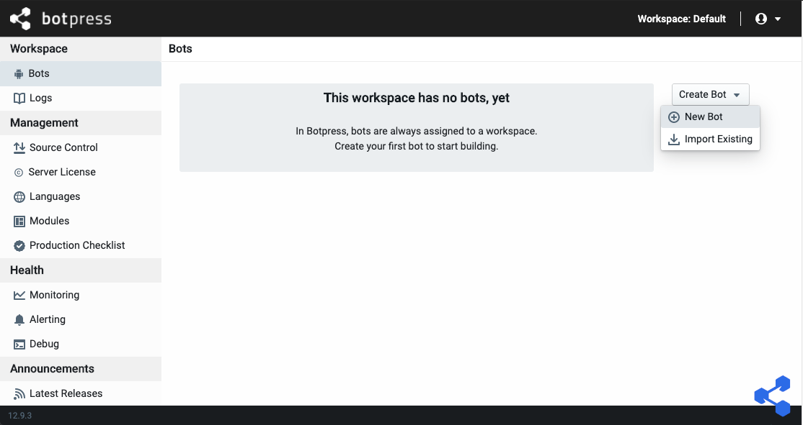
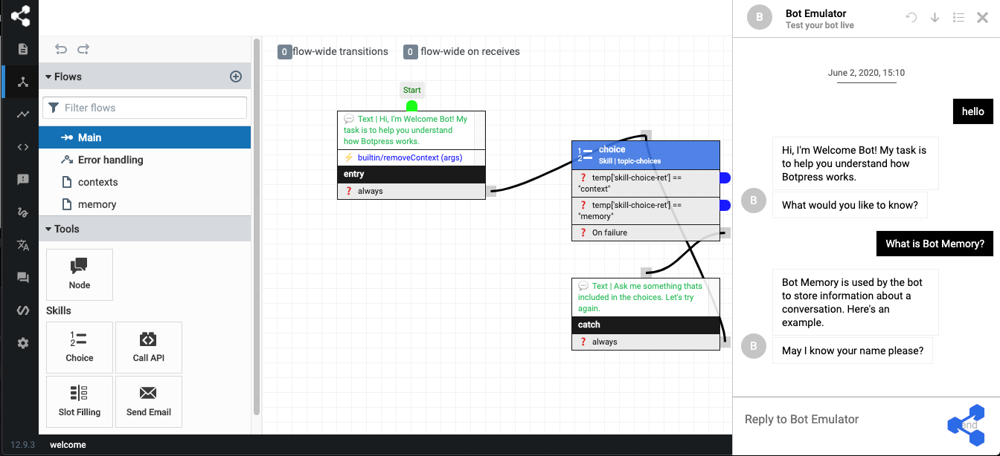

## Admin Dashboard

### Features

Here you'll be able to manage and configure everything related to your Botpress Server installation, including:

- Creating new bots
- Managing your Botpress Pro license and sync with version control
- Updating your profile and your Botpress Account
- Unpacking and activating modules

To open the Admin Dashboard, visit [`http://localhost:3000`](http://localhost:3000) in your favorite web browser. When you open the portal for the first time, you'll be asked to register the main admin account

### Creating a new bot

In Botpress, bots are assigned to a workspace. When you start Botpress for the first time, you'll have a default workspace created automatically for you.

Let's create a new bot with the **Create Bot > New Bot** button.

All you have to do is pick a name for your bot, a unique `Bot ID` will be generated for you, then select a bot template.

> The **Bot ID** can't be changed in the future so it's important to pick a meaningful name. Also, bear in mind that this ID will be visible to the users of your bots.

You may start from scratch with the Empty bot, or you can use one of the available templates for a quick demonstration of various features.

Once created, click on the bot's name to open the Studio interface and edit your bot.

## Studio Dashboard

The Studio is the main interface you'll use to build and edit your bot. From here, among other things, you can:

- Train an NLU model
- Create dialog flows
- Manage content
- Test and debug your bot

You will notice on the left menu there are a couple of sections available. Some of these are built inside Botpress (like _Content_ and _Flows_), while others are there because of modules installed. Indeed, Botpress is a highly modular platform, and the majority of the features you will use are provided by the modules themselves. You may use experimental ones, or even develop your own modules.

### Test your bot

There is a chat emulator built in the studio with which you can test your bot. You can open this emulator from the button in the top right corner, or press 'E' while in the studio. It is made to represent what your visitors will face when they speak with your bot. You can reset the conversation by clicking the reset button, or you can also start a new conversation with your bot with the conversations button.

*In the order presented: Debug, Reset, Download, Conversations, Close emulator.*

Open the chat window and say "_Hello_". If you selected the **Welcome Bot** template, it should greet you with something like "_Hi, I'm Welcome Bot! My task is to help you understand how Botpress works._".

You can get additional information from the emulator's debugger by selecting the debug button. This panel is specifically designed for you, as the bot owner, to understand quickly why you get a specific answer. Note that it is only available for authenticated users. It includes all sorts of useful information: the dialog engine's elected suggestion, nodes flowed through, and natural language intents or questions. You can also view the raw JSON event that contains all details if you need further data.

### Question and Answer

One of the modules shipped by default with Botpress is the Q&A (Question and Answer) module. This module allows you to easily and quickly add knowledge to your bot without having to create a flow or code anything. Q&A uses the NLU engine to detect the questions and automatically answer them.

#### Adding a Q&A

1. Click the **Q&A** panel on the left.
2. Click the "**Add New**" button.
3. Type in the "Questions" textbox any question, for example: "How old are you?". Then add as many different ways of asking the same question as you want.
4. In the "Answers" section, type the message you want your bot to provide, then press Enter to commit the answer.
5. Click "**Add**".

The Q&A module will automatically retrain the NLU model in the background and tell you when it's completed, indicated in the bottom right. You can speak again with your bot and it should respond to your question correctly, even if you make some typos!

#### Q&A Example

## Share your bot

### Standalone chat

Congratulations on building your first bot! You can share this bot with your friends, provided they have access to your computer, it is available at `http://localhost:3000/s/<<Bot ID>>`.

### Website embedding

You can also embed this bot on a website. There is an example provided in `assets/modules/channel-web/examples/embedded-webchat.html`, which you can see by browsing [**here**](http://localhost:3000/assets/modules/channel-web/examples/embedded-webchat.html).